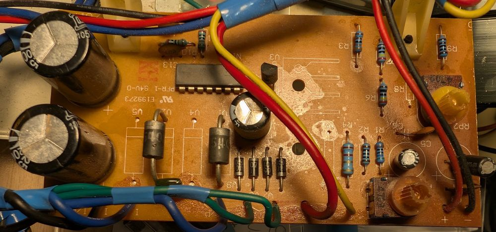
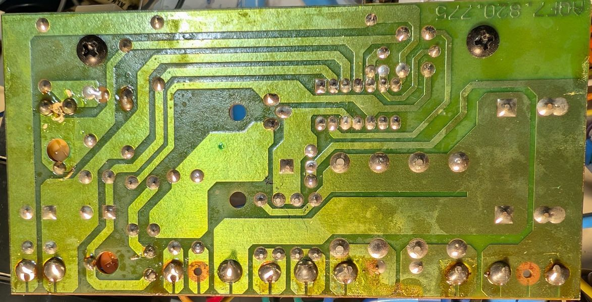
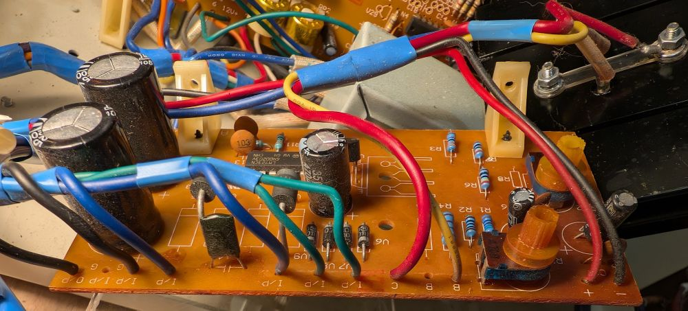

# 5V 3A supply

(Ref: AQF7.820.775)

**I haven't changed anything from the original design**, It's just a Kicad version of it. It's intended as a reference design to modify my power supply for my own needs.

## Schematic

This supply is based on the LM723 voltage regulator IC with a single 2n3055 ballast.

It use s middle tap transformer and an auxiliary winding to power the LM723. The general design is weird, but it's can be related to my own PS23023 power supply, as the serigraphy on the PCB for wires is a bit confusing.

Full schematic: [5v_supply.pdf](pdf/5v_supply.pdf)

## Pictures

### Front

### Back

### Pins serigraphy

