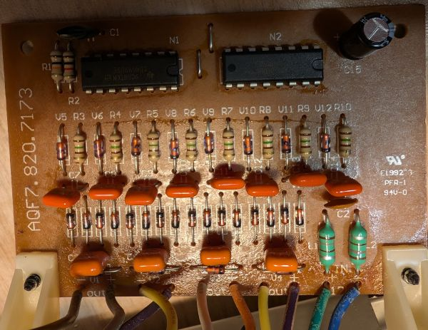

# PS23023 Linear Power Supply 

I did not find any Kicad design files for the PS23023 from Velleman online, so I created my own from the manufacturer's manual. The design of this power supply seems to be fairly common, their are many clones of it available. 

Manufacturer's manual: [Velleman_PS23023_manual.pdf](B5lJAFJ02yPxKAnPlHxN3OI$bLy67#^%swSE4Qk@sm$*9vJTr9yQ9*vxm1!SRTwx)

**I haven't changed anything from the original design**, It's just a Kicad version of it. It's intended as a reference design to modify my power supply for my own needs.

## Schematic

Board schematics are split into multiple projects:

### Master board

Ref: AQF7.820.7120

Master board: [master/README.md](master/README.md)

### Charge pump board

Ref: AQF7.820.7173

Charge pump board: [charge_pump/README.md](charge_pump/README.md)

### 5V 3A supply

Ref: AQF7.820.775

5V 3A supply: [5v_supply/README.md](5v_supply/README.md)

