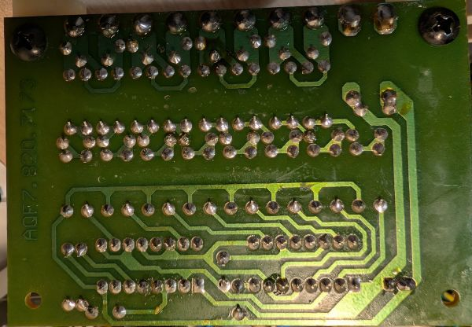

# Charge pump circuit 4x 9V

(Ref: AQF7.820.7173)

**I haven't changed anything from the original design**, It's just a Kicad version of it. It's intended as a reference design to modify my power supply for my own needs.

## Schematic

This is the charge pump schematic used to supply all lcd voltmeters/ammeter modules with 4 "isolated 9V supplies".

Switching circuit use only CD4049UBE and the frequency is set by R1 and C1. You can adjust them to change the frequency if needed. I measured around 40kHz with the given values.

Full schematic: [charge_pump.pdf](pdf/charge_pump.pdf)

## Pictures

### Front

### Back

