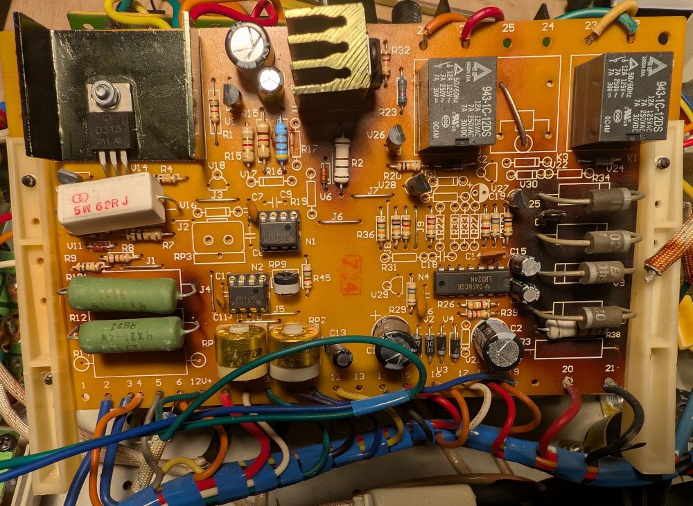
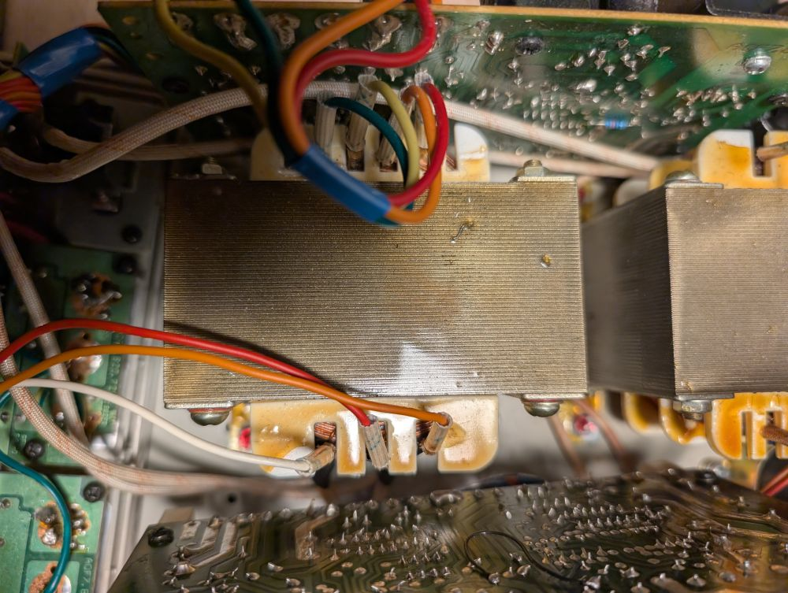

# Master Board 0-30V 0-3A

**I haven't changed anything from the original design**, It's just a Kicad version of it. It's intended as a reference design to modify my power supply for my own needs.

## Schematic

Master schematic, the slave is identical, except the control potentiometers are different because they are routed through Serial/Parallel/Independent switches.

### Root

Full schematic: [schematic.pdf](pdf/schematic.pdf)


### Auxilliary Power Supply


### Tap Switching


### Current Loop


### Voltage Loop


## Transformer

All voltages are measured without load.

```
Primary       Secondary
230v ---|   |--- 18v   (Aux winding)
        |   |
        |   |--- 0v
        |   |
        |   |--- -18v
        |
        |   |--- 39v    tap 1 (green)
        |   |
        |   |--- 31v     tap 2 (yellow)
        |   |
        |   |--- 16v   tap 3 (orange)
        |   |
0v   ---|   |--- 0v   tap 4 (red)
```

## Tap Switching

Here is the switching diagram of the transformer:

| Taps | Color | Voltage |
|------|-------|------------------------|
| 2-4  | Yellow-Orange | 14.6V |
| 1-4  | Green-Orange  | 22.7V |
| 2-3  | Yellow-Red    | 30.9V |
| 1-3  | Green-Red     | 39.0V |

We can see that voltages are not equally spaced.

## Tuning

The power supply can be tuned by adjusting the following components:

- **RP2**: Adjusts the maximum output voltage range.

- **RP1**: Adjusts the maximum output current range.

- **RP9**: Adjusts the offset current, to ensure 0A at minimum setting.

## Pictures

### Master PCB



### Transformer



### Ballast Transistor


## Notes

Some components may vary depending on the version of the power supply. For example, in my supply `U18`, `U17`, `R17` and `R19` are not populated. Also it shows some unpopulated components for an additional relay that is not present in my version.